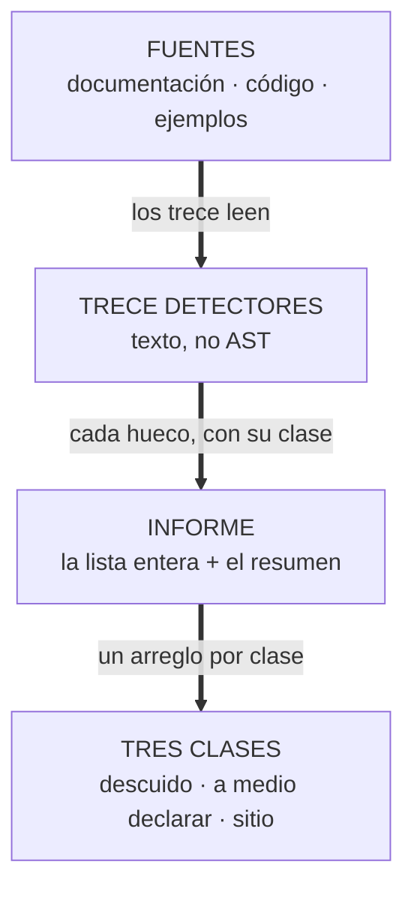
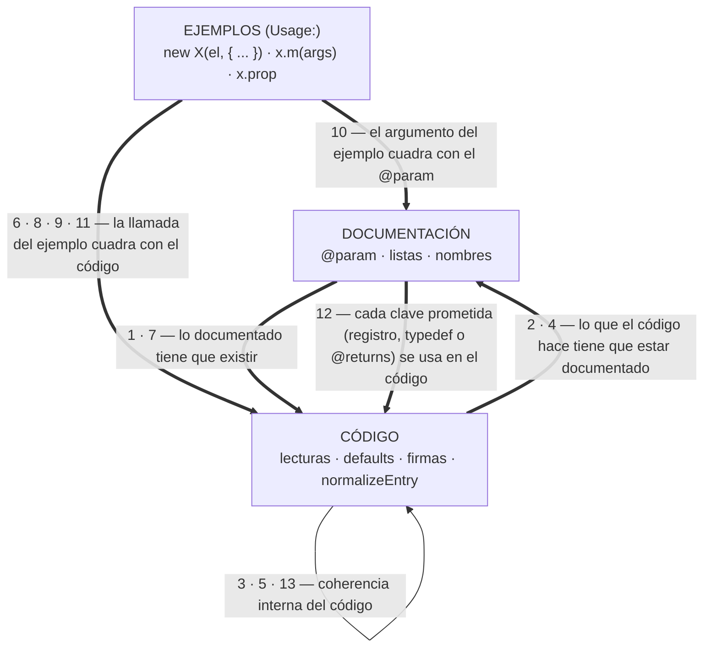

# ABDSharedAssets — familia de controles UI

Controles web reutilizables compartidos por toda la suite ABDSynths. Framework-agnostic:
DOM + options dentro, callbacks fuera. Ni JUCE ni bridge ni React dentro de los controles.

## Contrato de la familia

Todos los controles cumplen exactamente la misma API (el primero fue `Wheel`):

```js
import { Knob, Segmented, Select, Slider, Toggle, Wheel, XYPad } from '@abdsynths/shared/components';

const knob = new Knob(container, {
    label: 'Cutoff',
    value: 0.5,                  // normalizado 0..1 (o boolean en Toggle)
    onChange: (v) => {},          // SOLO ediciones de usuario
    onDragStart: () => {},        // gesto abierto (para automatización del host)
    onDragEnd: () => {},
});

// Select: modelo de valor = INDICE de opcion (el hermano discreto del boolean de
// Toggle). Normalizar a 0..1 queda al llamador, porque en un parametro `choice` ese
// mapeo lleva su propio skew/intervalo (contrato generado).
const select = new Select(container, {
    label: 'Destination',
    options: ['Off', 'LFO 1', { label: 'Pitch Quantize', disabled: true,
                                note: 'Requires the Neurotik engine' }],
    value: 0,
    id: 'control-mod1Destination',   // opcional: asocia el <label for> y deja localizarlo
    disabled: [2],                   // indices o (entry, index) => boolean
    onChange: (index) => {},          // SOLO ediciones de usuario
});

select.setDisabled((entry, index) => index === 2);   // disponibilidad dinamica
select.isDivergent();   // true si el valor actual cae en una opcion no disponible

// XYPad: mismo contrato, valor 2D. y=1 es ARRIBA (convención NEURONiK XYPad.cpp).
// Superficie ABSOLUTA: click salta al punto. setValue({x,y}) silencioso para
// snapshots del bridge; onChange({x,y}) solo en ediciones de usuario.
const pad = new XYPad(container, {
    x: 0.5, y: 0.5,              // valor inicial normalizado
    width: 220, height: 220,
    corners: ['Piano', '', 'Bell', ''],
                                 // OPCIONAL: etiqueta por esquina [arriba-izq,
                                 // arriba-der, abajo-izq, abajo-der]; '' oculta
                                 // su esquina. Con esquinas visibles el readout
                                 // se esconde: el valor sigue en aria-valuetext.
    onChange: ({ x, y }) => {},
    onDragStart: () => {},
    onDragEnd: () => {},
});

pad.setValue({ x: 0.2, y: 0.8 });   // programático: NO dispara onChange
pad.setCorners(['Piano', 'Rhodes', '', '']); // etiquetas en caliente (morph pads)
pad.getValue();                      // -> { x, y } (copia)
pad.destroy();
```

Reglas (las cumple cualquiera que se añada en el futuro):

1. **Valor normalizado 0..1** (o boolean, o **índice de opción**). El mapeo a unidades
   reales es del llamador, igual que el contrato de parámetros del plugin. El `Select`
   usa el índice porque un parámetro `choice` guarda su índice y el mapeo
   índice<->normalizado lleva el skew del propio parámetro: meterlo aquí arrastraría
   matemática del APVTS a la capa compartida.
2. **Interacción por `drag-core.js`**: drag vertical/horizontal, rueda y flechas del
   teclado. Ningún control implementa su propia matemática de punteros. Excepción
   documentada: el `Select` NO usa drag-core — arrastrar por una lista de 28 opciones
   elige valores por accidente, que es peor que no ofrecerlo. El desplegable nativo y
   las flechas cubren la edición, y un test fija que un drag no cambia el valor.
3. **Theming solo por tokens CSS** (`styles/tokens.css`): `--color-accent`,
   `--color-panel-surface`, `--text-*`... con fallbacks literales para usarse sin tokens.
4. **Sin WebGL**: el catálogo `RESOURCES/ui_componants-main` tiene efectos de demo con
   GL; aquí se extrae el control y su brillo se resuelve con CSS box-shadow.
5. **destroy() limpia todo** — un control destruido no deja listeners ni DOM.
6. **Accesibilidad** (auditada en bloque, 2026-09): todo control de valor lleva ROL
   y NOMBRE accesible — `aria-label` = `ariaLabel` ?? texto del `label` visible
   (un control anónimo queda sin nombre pero SIEMPRE nameable por el host). Semántica
   de valores completa: `aria-valuemin/max/now` + `aria-valuetext` formateado. Roles:
   Knob/Slider/XYPad = `slider` (el pad, aunque sea superficie absoluta: su teclado
   MUEVE el valor; el pointer es un método de entrada, no un rol), Slider vertical
   declara `aria-orientation="vertical"`, Toggle = botón con `[aria-pressed]` +
   `ariaLabel` para usos de solo-icono, Segmented = `radiogroup` con roving tabindex
   y nombre del grupo vía `<label for>` (con id) o `aria-label` (sin id), NumberBox =
   `spinbutton` con botones `+/-` nombrados `increase/decrease`, Select/Wheel =
   `<select>`/`<input type=range>` nativos (semántica gratis), LcdPanel = botones de
   glifo con nombre explícito (`‹` = "Cursor left"...) y pantalla `role=status`
   `aria-live=polite`. Fijado por `tests/accessibility.test.js`.

## Ficheros

```text
components/drag-core.js     núcleo DRY de arrastre (attachDrag, clamp)
components/knob.js          knob rotatorio (270°) — comportamiento + contrato
components/select.js        lista de opciones (nativa <select>), opciones deshabilitables
components/segmented.js     selector segmentado (radiogroup plano), gemelo del Select
components/slider.js        slider horizontal/vertical, thumb filmstrip opcional
components/toggle.js        botón LED (latched o momentary), estado en [aria-pressed]
components/wheel.js         rueda pitch/mod filmstrip (la original de la familia)
components/xypad.js         pad 2D absoluto ({x,y}, y-up) — morphing, filtros XY
components/drawer.js        cajón lateral fijo a la derecha (createDrawer): contenido
                            estable (sin re-render al abrir), ESC/fondo/botón, dialog
components/optionIndex.js      el indice como valor compartido: recorte del
                                valor, recorrido de flechas y el nodo de nota que
                                explica un veto (Select y Segmented)
components/indexControl.js      la BASE de los controles de indice: el valor,
                                las notas que explican un veto, la divergencia
                                y el teardown (Select y Segmented la extienden)
components/transitionNotices.js  contrato de avisos de TRANSICION: un cambio
                                real avisa una vez, una intencion sin cambio no
components/continuousNotices.js  el hermano para gestos: onChange vivo por
                                paso y onSettled al cerrar, solo si algo cambio
components/overlayFocus.js       foco e inert de los overlays de la familia
components/modMatrix.js          VISTA de las rutas de modulacion (no escribe
                                valores; el contrato, contracts/modulation_matrix)
components/lcdMachine.js         maquina de lectura del LCD (createLcdMachine)
components/lcdPanel.js           panel de LCD, y lcdScreen.js su lectura
components/numberbox.js          caja numerica con incremento y limites
components/sevenSegmentDisplay.js  display de 7 segmentos (entrada y salida)
components/filmstripFader.js     fader con tira de imagen, y
components/silverFilmstripKnob.js  su hermano de knob
components/fitStage.js           escalado que encaja sin deformar
components/themeSwitcher.js      selector de tema
components/peakLED.js            LED de pico, effectLEDButton.js el de efecto
components/tapeEchoVisual.js     visual de cinta y eco
components/waveforms.js          nombres y glifos de onda
components/fxTheme.js            tema de un modulo de efecto, POR FAMILIA
                                (el aspecto, styles/components/fx.css)
components/skins/index.js   SKINS: cómo se dibuja cada control (registry + 3 skins)
components/index.js         barrel: controles + registerSkin/getSkin/applySkin
styles/components/widgets.css     estilos base de knob/slider/toggle/select
styles/components/skins-junio.css   estilos de la skin 'junio'
styles/components/fx.css        estilos de los modulos de efecto y sus temas
contracts/fx-effects.json       catalogo de efectos del rack (57 ids, 11 familias)
smoke/                          arnes de accesibilidad (pnpm smoke:a11y)
tests/audit/                    la auditoria de documentacion (ver mas abajo)
tests/controls.test.js      vitest: contrato, clamping, semántica, gestos, skins, cleanup
tests/setup.js              polyfill PointerEvent para jsdom
```

## Skins: cada synthe elige su look

El COMPORTAMIENTO vive en el control (valor, drag-core, contrato); el ASPECTO vive en una
skin intercambiable. Una skin es un **mapa de renderers por tipo de control**
(`{ knob, slider, toggle }`): se declara el nombre una vez y cada control resuelve el
suyo — sin prefijos 'toggle-'/'slider-':

```js
import { Knob, Slider, Toggle, registerSkin } from '@abdsynths/shared/components';

new Knob(el,   { skin: 'ms2000' });  // knob vector rim/cap/dot (extracto ABDMS2000)
new Slider(el, { skin: 'junio'  });  // fader slot+cap fotográfico (extracto JUNiO)
new Toggle(el, { skin: 'junio', colorName: 'orange' });  // sprite PNG on/off por color
new Knob(el);                        // 'vector' (por defecto, sin assets)

// Skin propia de un proyecto (mapa parcial: lo que falte cae al renderer 'vector'):
registerSkin('mysynth', {
    knob (host, control) {
        const root = document.createElement('div');
        /* ...pintar; update() relee control.getValue()... */
        host.appendChild(root);
        return { root, update () {}, destroy () {} };
    },
});
```

Despacho: `applySkin()` etiqueta cada instancia con `CONTROL_KIND` (knob | slider |
toggle | select) y elige `map[kind]`; si la skin no define ese tipo, usa el renderer
'vector' del mismo tipo (skins parciales siguen siendo utilizables).
Nombre de skin desconocido → la skin entera es 'vector'.


Origen de las skins incluidas:

Un tipo sin renderer en NINGUNA parte ahora falla con un error explícito, porque
antes salía como "fn is not a function" y parecía un error del llamador.

| Skin      | Extraída de           | Cubre | Mecánica |
|-----------|-----------------------|-------|----------|
| `vector`  | nueva (base)          | knob, slider, toggle, select | CSS/SVG puro, sin assets |
| `ms2000`  | ABDMS2000 `rotaryKnob.js` | knob, toggle, select | SVG rim+cap+indicador; toggle y select variantes de tokens |
| `junio`   | ABDJUNiO601 assets (`knob.png`, `slider_cap/slot.png`, `button_*_on/off.png`) | knob, slider, toggle | PNGs por transform/position; toggle elige sprite por `colorName` + `aria-pressed` |

Ojo con los nombres: `styles/components/controls.css` (la librería CSS, anterior a la
familia JS) ya estiliza un `<select class="abd-select">` crudo, y hay páginas que cargan
las dos hojas. Por eso el bloque `.abd-select` de `widgets.css` no impone layout — el
apilado es opt-in vía `.abd-select--labelled`, que el control añade solo cuando tiene
etiqueta — y el campo lleva su propia clase. Un `<select>` suelto sigue viéndose igual.

La skin 'junio' necesita sus sprites servidos desde la raíz del paquete
(`assets/junio/`); las URLs del CSS son **relativas al propio CSS**, así que funciona
con `file://` y con cualquier servidor estático. Para páginas en subcarpetas (p. ej.
`demo/`), el knob acepta `spriteUrl` explícita. Las otras skins no necesitan assets.

### Fondo de lienzo tintable (`assets/backgrounds/`)

`bg_neutral.png` (1672x941, gris medio-acromático) es el fondo GENÉRICO de la suite y el
MÁSTER bit-exacto; `bg_tile512.webp` (341 KB, tile seamless sin pérdida) es el que se sirve
por defecto (`repeat`, costura medida 0.000, banding 267/MP — 3x mejor que el master); 
`bg_neutral.webp` (1.9 MB) es la variante FULL-BLEED opt-in (`.abd-theme-bg--full`, `cover`).
Métricas completas en `docs/STYLES_GUIDE.md` §4b. El PNG: no lleva color — el tema lo tiñe. Uso: `class="abd-theme-bg"` en el contenedor y
`--abd-bg-tint` con el color del tema (`styles/components/backgrounds.css`, mezcla
`soft-light` para que el tono y la luminancia del tema manden y la textura module). Un
tema puede usar OTRO fondo con `--abd-bg-image` (URL relativa a SU css). Pesos y
convención de nombres de fondos nuevos: ver la cabecera de `backgrounds.css`.

### Temas — modo claro (`[data-theme="light"]`)

`styles/tokens.css` define el tema oscuro en `:root` y el MODO CLARO en `[data-theme="light"]`:
el MISMO juego de tokens de color/sombra con valores de contraste medido (ratios WCAG en la
cabecera del bloque). El test `tests/tokens.test.js` vigila las dos direcciones: todo token
de color/sombra del :root tiene version clara, y el claro no inventa tokens ni pisa
tamanos/espaciados/fuentes. Se activa con `data-theme="light"` en `<html>` (convencion
MS2000) o en `<body>` (convencion del demo, que tiene un boton Light). El LCD no cambia —
es autoiluminado como el hardware. El fondo tintable sigue automaticamente: `--abd-bg-tint`
por defecto es `var(--color-bg-base)` y `backgrounds.css` re-resuelve el tinte en el
elemento tematizado (`[data-theme]`), asi funciona con las dos convenciones de colocacion.

**Selector universal — `components/themeSwitcher.js` (`ThemeSwitcher`):** el interruptor es
compartido, los TEMAS son de cada synth. Aplica `data-theme` en el elemento raiz que se le de
(`<html>` o `<body>`), persiste opcionalmente y su `destroy()` desacopla listeners de verdad.
El tema `dark` se aplica SIN atributo (es el `:root`): el default de la pagina no depende del
atributo. Tres funciones universales probadas en MS2000 (migrado el 2026-09-20):

- `variant: 'select'` — un `<select>` unico compacto (alternativa a los botones), accesible
  de serie. El value del select ES el id del tema; `setValue()` lo sincroniza.
- `bodyClass` por tema — la clase de skin (`skin-*`) viaja como DATO del tema; el switcher
  la aplica en `<body>` con politica de DUENO unico (retira la anterior al cambiar y al
  destroy). Un synth ya no toca `document.body.className` a mano.
- `payload` por tema — dato opaco del synth (MS2000 manda el indice de `synthMode`) que
  `onChange(themeId, payload)` entrega como segundo argumento y `.payload` expone.

Su CSS vive en `styles/components/widgets.css` (`.abd-theme-switcher` y variante
`--select`), resuelto con tokens de la cascada.

El principio de la suite aqui: un synth define SOLO los tokens de color (bloques
`[data-theme=...]`) y ELIGE los tipos de elemento que usa (knob, slider, XYPad, fondo
tintable, LCD...). Los estilos de los elementos, las sombras, el comportamiento y los
mecanismos (temas, fondo, ajuste al viewport) son UNIVERSALES en este paquete: los skins
cambian FORMA (registerSkin), los temas cambian COLOR (tokens), ambos se resuelven con las
mismas variables.

**FitStage — `components/fitStage.js` (`computeFit`, `mountFitStage`):** el ajuste del
lienzo de diseno al viewport, como infraestructura de pagina (NO es un control: no lleva
el contrato constructor/setValue). El lienzo es de tamano FIJO y la ventana cambia: sin
ajuste, una ventana mas baja que el diseno corta por abajo el pie y la franja de teclado.
`mountFitStage(stage, { width, height })` escala con `transform` y centra el eje que
sobra; `computeFit` es el calculo puro (testeable sin DOM). Las cotas son parametro
(`minScale`/`maxScale`, defaults 0.25x..3x): cada synth decide si quiere tope o no.

REQUISITO de uso (composicion de la pagina, no mecanismo): el CSS de la pagina debe llevar
`body { overflow: hidden }` — `transform` no cambia el box de layout y sin esa regla el
lienzo sin escalar generaria scrollbars. El tamano de diseno SIEMPRE por parametro: el
paquete no conoce lienzos ajenos (NEURONiK pasa su `CANVAS` de sections.js; CZ101, su
1409x768).

CONSUMIDORES (los cuatro synths): NEURONiK y MS2000 importan del barrel
(`@abdsynths/shared/components`) — NEURONiK con su lienzo fijo (`CANVAS` de sections.js);
MS2000 en modo FLUIDO: floor de diseno (`min-width/min-height` 1080x680 en `#app`) +
`onlyShrink: true` — identidad por encima del diseno, escala por debajo; las media queries
del dashboard siguen mandando el reflow (el fit solo garantiza que nada se corte).
CZ101 y ABDEep no tienen bundler: COPIA GESTIONADA — `node scripts/sync_shared.js` (CZ101)
o `node scripts/sync_shared.mjs` (ABDEep) copian el modulo verbatim a
`WebUI/src/shared/fitStage.js` (ABDEep anade el glue ESM `js/fit-stage.js`, unico modulo de
su app) y el test de cada uno lo compara byte a byte contra el paquete — editar la copia a
mano rompe la suite a proposito. El LCD universal debera elegir el mismo camino.

`onlyShrink` (paginas fluidas): a identidad los margenes de centrado son 0 y el transform se
LIMPIA — un `scale(1)` residual crea containing block y re-anclaria overlays
`position: fixed` (drawer, modales). `stageWidth`/`stageHeight` declaran la caja NATURAL del
stage cuando su CSS puede exceder el diseno (el floor de una pagina fluida): el centrado
apunta a la caja escalada real, no al diseno, y no recorta el eje no limitante.

**LCD universal — `components/lcdMachine.js` + `lcdScreen.js` + `lcdPanel.js`:** la maquina
de estados es PURA (Idle/Navigation/Edit, arbol de menu INYECTADO por el synth, items
`parameter`/`cc`/`action`, profundidad libre, hooks `onEdit/onAction/onPreview`): herencia
directa del `LcdMenuManager` nativo de NEURONiK (retirado en c811b75, recuperado de git).
La pantalla (`createLcdScreen`) lleva autoscroll ping-pong caracter a caracter (CZ101),
preview con timeout (LcdDisplay nativo) y cola de mensajes con prioridad (ABDEep). El
panel (`createLcdPanel`) anade el D-pad MENU/OK/cursores con hold-repeat (initial 400ms,
repeat 120ms). Guia completa con el plan de adopcion por synth: `docs/LCD_GUIDE.md`. El
port C++ vive en ABDSharedCode/LcdDisplay (`ABDShared::LcdDisplay`, INTERFACE, gate WASM).

### Segmented — `components/segmented.js` (`Segmented`)

**Selector segmentado: el hermano compacto del `Select`, para las listas de DOS
opciones que se muestran de una vez** (motor, sync de LFO). Mismo contrato de
familia (constructor/setValue/getValue/destroy/onChange silencioso en setValue,
valor = ÍNDICE, opciones deshabilitables con nota, valor divergente conservado y
marcado `[data-divergent]`). La diferencia es el mueble: cada opción es su
propio botón en una fila plana (flex: 1 1 0 — N opciones llenan la celda del
llamador), con roving tabindex y flechas ←/→/↑/↓ que saltan los vetados.

La contraparte nativa vive en ABDSharedCode (`Segmented/Segmented.h`,
`ABDShared::Segmented`, INTERFACE + sonda opt-in): radio group de TextButtons
con togglestate, vetados y nota via tooltip, `setActive` sin notificar y
`onChange` solo en edición. Mismo reparto de trabajo que en la web: 2-4
opciones visibles en segmentos; listas largas en combo desplegable.

## Demo

`demo/demo.html` (sección 8) muestra la familia completa: knob/slider/toggle en las tres
skins, colores del toggle junio y un toggle momentary. Sirve la raíz del paquete y abre
`/demo/demo.html`:

```bash
cd ABDSharedAssets && npx vite . --port 5199   # o cualquier servidor estático
```

El bootstrap de la sección vive en `demo/demo-controls.js` (HTML declarativo, controles
instanciados desde el módulo).

Todo control **nuevo** se mantiene por debajo de 300 líneas; si un control crece, se divide.

La división que funciona aquí no es partir un fichero en trozos, sino
**sacar la clase base**: `Select` y `Segmented` compartian el valor, el veto, las
notas y el teardown, y con eso basta para pasarse. Ahora eso vive en
`IndexControl` (259 líneas) y lo que no necesita DOM en `optionIndex.js` (188), de
modo que los dos controles quedan en 240 y 300 y las dos entradas que ocupaban en la
lista de excepciones se han ido. Se reparte el trabajo por lo que se REUTILIZA, no
por tamaño del trozo: un troceo que nadie mas hereda solo ha movido el problema.

Los que aún no caben siguen fichados uno a uno en
`EXCEPCIONES_DE_TAMANO` (`tests/ciContract.test.js`), y el contract lo comprueba en las dos
direcciones — un sexto por encima del límite sale en rojo, y una excepción cuyo fichero ya
cabe también, para que la lista se vaya vaciando sola en vez de crecer en silencio. Los
nombres no se cuentan aquí a propósito: una segunda lista en la guía sería otra cosa que se
queda vieja sin que nadie lo note.

## Consumo sin NTFS junctions

La vía preferida hoy es **npm/pnpm**, no enlaces de directorio:

- Proyectos del workspace pnpm: `"@abdsynths/shared": "workspace:*"` (como ya hace
  `@abdsynths/midi-keyb` en ABDMS2000).
- Proyectos fuera del workspace (ABDNeural/WebPilot): instalar con
  `pnpm add @abdsynths/shared --workspace-root` no aplica; usar `file:../ABDSharedAssets`
  en `dependencies`, o servir `components/` y `styles/` como recursos estáticos del host.
  Los NTFS junctions de `docs/INTEGRATION_GUIDE.md` quedan como mecanismo legacy para
  los proyectos que ya los usan; nada nuevo debe depender de ellos.

## Auditoría de documentación (13 reglas)

La documentación de este paquete no es un adorno: cada `@param`, cada lista de valores y
cada bloque `Usage:` promete algo que el código tiene que cumplir, y alguien tiene que
comprobarlo. Eso es lo que hace esta auditoría, con trece detectores que se leen el
propio fuente —no un parser de JavaScript, sino el texto— y que corren como una puerta
que se abre con `pnpm exec vitest run tests/documentedOptions.test.js`.

Ese mismo comando lo corre el CI en su paso propio, antes que la suite, desde el
workflow `docs-audit.yml`: si los dos se separan, la puerta se queda en el suelo y
nadie lo nota hasta que hay un PR verde con la guía mintiendo. Un fallo sale como
**descuido**, como **entrada a medio declarar** o como **hueco de sitio**, que son tres
arreglos distintos —borrar una línea de más, cablear una entrada, escribir un bloque de
la guía— y por eso el informe los cuenta por separado y los agrupa por sitio.



El informe enseña los huecos de una vez —una entrada a medio cablear sale entera, con
sus sitios, en vez de fallar en el primero y esconder los demás— y detrás un resumen que
los cuenta por clase y por sitio.

### De un vistazo



Tres fuentes —la documentación, el código y los ejemplos— y seis aristas. Cada arista
lleva los números de las reglas que la sostienen y el lema de lo que la regla juzga; una
regla que no aparece en ninguna no tiene flecha, y eso el diagrama lo enseña solo.

La auditoría **sigue la herencia**. Cuando un control extiende a otro, el «código»
de la pregunta no es solo su fichero: para las tres reglas que preguntan si algo SE USA
(3 · 5 · 8) el alcance es el CONTRATO —su fichero y los de su cadena de bases, hasta
la más lejana y con un corte si se forman un bucle—, porque un `entry.disabled` que
lee el veto de `IndexControl` está ledo aunque `Select` no lo escriba, y un `destroy()`
que viene heredado sigue siendo un método del receptor. Lo de DOCUMENTAR se queda en
cada fichero a propósito: una clase base es un módulo más, con sus propias promesas, y
juntarlas haría que se juzgara dos veces. Sin esto, partir una clase en dos no se
notaba — no era que el código hiciera menos, era que la puerta se quedaba mirando un
trozo—; con esto, el cambio sale del contract antes de romper nada.

### La tabla de las trece reglas

| #  | Regla | Qué persigue |
|----|-------|--------------|
| 1  | Opciones documentadas | Un miembro que solo vive en la documentación y el código no menciona. |
| 2  | Opciones leídas | Al revés: el código lee `options.x` (o desestructura la `x`) y `x` no está documentado. |
| 3  | Claves de entrada | Cada clave que `normalizeEntry` guarda tiene que leerse como `entry.clave` fuera del normalizador. |
| 4  | Defaults | El literal que el código aplica como default tiene que estar prometido en la documentación. |
| 5  | Opciones guardadas | Una opción que el código solo copia a un hueco y no vuelve a leer está muerta: no hay nada que configurar con ella. |
| 6  | Ejemplos de uso | Toda opción de un `new Clase(el, { ... })` documentado —o del objeto que vive tras un envoltorio transparente, `new X(el, wrap({ ... }))`— tiene que ser una que ESA clase lea de verdad. |
| 7  | Valores enumerados | Cuando la documentación enumera el dominio de una opción, ni el código ni los ejemplos salen de la lista. |
| 8  | Métodos de los ejemplos | Todo método que un ejemplo llama sobre el objeto que el mismo bloque construye tiene que estar declarado por la clase. |
| 9  | Aridad | Esa llamada —y el `new Clase(...)`— tiene que pasar un número de argumentos que la firma declare. |
| 10 | Tipos de los argumentos | El argumento —y el callback de un campo de función inline, `function(a, b): c`— tiene que ser de la familia que promete el `@param {tipo}` de su parámetro. |
| 11 | Forma de los accesos | El ejemplo tiene que tocar cada miembro como la clase lo declara: método llamado, getter leído, setter escrito. |
| 12 | Registros prometidos | Cada clave prometida en un registro —el tipo inline de un `@param`, un `@typedef` o el `@returns {{ ... }}` de un callable— tiene que usarse de verdad en el código. |
| 13 | Opciones en su sitio | El objeto de opciones va detrás de otro parámetro. No es un juicio de documentación —el código funciona igual en las dos posiciones—: es la convención del repo, y lo que protege es la diferencia real entre el elemento primero y las opciones primero. Una entrada de un solo parámetro se exime: no hay dónde ponerlas. |

La columna «Qué persigue» la escribe la entrada de cada regla y la tabla entera se genera
desde el catálogo, así que una palabra cambiada en la prosa no puede quedarse cambiada
solo en un lado. La columna que no está es la de lo que cada regla NO juzga, y esa vive
en su apartado.

### Cómo el audit sigue un receptor

Un bloque de ejemplo habla de un objeto de cinco maneras distintas y no dice cuál: el
audit tiene que resolverlas todas antes de poder juzgar una llamada. Estas son todas, y

- **Atado** (`const x = new X(...)`) — el ejemplo nombra el objeto y todo lo que viene
  detrás habla de ese nombre;
- **Alias** (`const y = x`) — el nombre cambia, el objeto no: lo que se juzga es lo que
  hay debajo;
- **Encadenado** (`new X(...).m(...)`) — no hay nombre, y aun así hay receptor;
- **Opcional** (`x?.m(...)`) — el mismo nombre, con una llamada que puede no ocurrir;
- **Fábrica** (`const x = createY(...)`) — lo que se recibe no es una clase sino lo que
  devuelve una función, y hay que leer sus miembros.

Una forma que no está en esta lista no se juzga, y por eso la lista es corta a propósito.

### Las trece reglas, una a una

Cada apartado trae lo que la regla juzga, el bloque de mensaje que el detector suelta
cuando encuentra un fallo —generado desde la receta, no escrito a mano— y lo que su
receta prueba y lo que no llega a probar.

**1. Opciones documentadas** (`unusedMembers`).

El nombre que la guía promete y nadie pronuncia. No pregunta si el miembro hace algo
útil: pregunta si existe en el código, que es la pregunta más barata y la que más
sorpresas da cuando el JSDoc se copió de otro sitio.

Lo que suelta el detector:

```text
themeSwitcher.js: todo miembro documentado se menciona en el código
expected [ 'zzzGhost' ] to deeply equal []
```

Y su receta, que es un módulo de verdad al que se le rompe algo a propósito:

> **La receta prueba:** documenta un miembro nuevo en un modulo de verdad y mira que el
>   detector lo delate sin tocar nada mas

> **No llega a:** la variacion valida tambien reescribe el modulo, asi que el caso no prueba
>   que el detector acepte un archivo sin cambios

**2. Opciones leídas** (`undocumentedReads`).

La otra mitad del mismo oficio, y la que más tumbuh: lo que el constructor lee de
`options` tiene que estar escrito arriba, porque quien configura el control no tiene
otra forma de saber qué se le puede pasar.

Lo que suelta el detector:

```text
effectLEDButton.js: toda opción que el código lee está documentada
expected [ 'zzzGhost' ] to deeply equal []
```

Y su receta, que es un módulo de verdad al que se le rompe algo a propósito:

> **La receta prueba:** mete una lectura nueva en el constructor de un modulo real y
>   comprueba que el detector la nombre sin que nadie la prometa

> **No llega a:** la variacion valida lee una opcion que ya estaba prometida, de modo que el
>   caso no dice nada de una lectura que llega a usarse

**3. Claves de entrada** (`unreadEntryKeys`).

Los controles con entradas —un `select` con sus grupos, un `segmented` con su mapa—
normalizan sus claves en un sitio y las leen en otros. Una clave que se guarda y nunca
se vuelve a leer es una opción que nadie puede usar.

Lo que suelta el detector:

```text
select.js: toda clave que normalizeEntry guarda se lee fuera del normalizador
expected [ 'zzzGhostKey' ] to deeply equal []
```

Y su receta, que es un módulo de verdad al que se le rompe algo a propósito:

> **La receta prueba:** anade una clave al normalizador de un modulo real y mira que el
>   detector la ve viva solo dentro de el

> **No llega a:** la variacion valida cambia como se lee una clave que ya se leia, asi que
>   el caso no toca el alcance de la cuenta

**4. Defaults** (`undocumentedDefaults`).

El default del constructor es una promesa en miniatura: si el código aplica un valor
que la guía no menciona, quien lee la guía no sabe qué pasa si no lo pasa.

Lo que suelta el detector:

```text
effectLEDButton.js: todo default literal del código está documentado
expected [ 'size=gigante' ] to deeply equal []
```

Y su receta, que es un módulo de verdad al que se le rompe algo a propósito:

> **La receta prueba:** cambia el default de un constructor por un valor que la lista de
>   documentados no promete, y el detector lo ve al arrancar el modulo

> **No llega a:** la variacion valida se queda dentro de los valores que si estan en la
>   lista, que es donde el detector tiene algo que decir

**5. Opciones guardadas** (`inertOptions`).

Copiar una opción a un hueco y no volver a tocarla es escribir código que parece
configurable y no lo es. La regla no juzga el valor, solo que alguien lo lea.

Lo que suelta el detector:

```text
effectLEDButton.js: toda opción guardada se vuelve a leer
expected [ 'zzzGhost' ] to deeply equal []
```

Y su receta, que es un módulo de verdad al que se le rompe algo a propósito:

> **La receta prueba:** copia una opcion al objeto sin leerla nunca, y el detector la delata
>   por el camino que no la recorre

> **No llega a:** la variacion valida cambia el valor de una opcion que el codigo si lee,
>   con lo que el caso no prueba nada de una copia sin lectura

**6. Ejemplos de uso** (`staleUsageOptions`).

El ejemplo es documentación que se ejecuta en la cabeza de quien lee. Si enseña una
opción que la clase ya no acepta, el ejemplo es la mentira.

Lo que suelta el detector:

```text
xypad.js: las opciones del ejemplo existen de verdad
expected [ 'XYPad.zzzGhost' ] to deeply equal []
```

Y su receta, que es un módulo de verdad al que se le rompe algo a propósito:

> **La receta prueba:** pon una opcion en el objeto del ejemplo que el ejemplo ya no usa, y
>   el detector la delata como una entrada vieja

> **No llega a:** la variacion valida cambia una opcion que el ejemplo si usa, asi que el
>   caso no juzga el valor de ninguna de las dos

**7. Valores enumerados** (`offListValues`).

Cuando la guía escribe el dominio de una opción, ese dominio es un contrato: lo que
el código acepte tiene que estar dentro, y lo que se acepte y no esté, sobra.

Lo que suelta el detector:

```text
wheel.js: el código y los ejemplos usan valores de la lista documentada
expected [ 'type=zzzGhost' ] to deeply equal []
```

Y su receta, que es un módulo de verdad al que se le rompe algo a propósito:

> **La receta prueba:** mete un valor que no esta en la lista documentada de la opcion y
>   mira que el detector lo compare contra ella

> **No llega a:** la variacion valida usa otro valor de la misma lista, asi que el caso no
>   prueba que la lista se lea entera ni que se lea una vez

**8. Métodos de los ejemplos** (`missingExampleMethods`).

Un ejemplo llama a un método que la clase no declara: el ejemplo es copiado de otro
control y nadie lo ejecutó nunca. Aquí no se juzga con cuántos argumentos se llama
—de eso se ocupa otra regla— sino con si el método existe.

Lo que suelta el detector:

```text
wheel.js: todo método que llama el ejemplo existe en la clase
expected [ 'Wheel.zzzGhost()' ] to deeply equal []
```

Y su receta, que es un módulo de verdad al que se le rompe algo a propósito:

> **La receta prueba:** llama en el ejemplo a un metodo que la clase del receptor no
>   declara, y el detector nombra esa llamada

> **No llega a:** la variacion valida llama a un metodo que si existe, de modo que el caso
>   no prueba que el receptor sea una instancia y no una fabrica

**9. Aridad** (`arityMismatches`).

Que el método exista no basta: hay que llamarlo con los argumentos que la firma
promete. Un default, un objeto vacío detrás del destructuring o un resto no obligan a
pasarlos, y el detector los cuenta como lo que son.

Lo que suelta el detector:

```text
wheel.js: el ejemplo llama y construye con la aridad de la firma
expected [ 'Wheel.setValue(): recibe 3, la firma acepta 1..2' ] to deeply equal []
```

Y su receta, que es un módulo de verdad al que se le rompe algo a propósito:

> **La receta prueba:** anade un argumento de mas a una llamada que la firma ya cerraba,
>   sobre el modulo de ejemplo del repositorio

> **No llega a:** la variacion valida cambia el valor del segundo argumento y deja el numero
>   como estaba, asi que el caso no prueba nada de un resto en la firma

**10. Tipos de los argumentos** (`mistypedExampleArguments`).

Y que el argumento sea del tipo que el `@param` declara. La regla se calla donde no
hay dos lados que hablar claro, en vez de inventar un juicio que no se sostiene.

Lo que suelta el detector:

```text
wheel.js: el ejemplo pasa argumentos del tipo que promete la documentación
expected [ 'Wheel.setValue(): el argumento 1 es string y la firma promete number' ] to deeply equal []
```

Y su receta, que es un módulo de verdad al que se le rompe algo a propósito:

> **La receta prueba:** pasa un string donde la firma promete number, en una llamada atada a
>   su receptor, y el detector cruza los dos lados

> **No llega a:** la variacion valida pasa otro numero por el mismo sitio, asi que lo unico
>   que cambia entre los dos casos es el tipo que se juzga

**11. Forma de los accesos** (`mismatchedExampleAccesses`).

La misma llamada puede estar mal por la forma en que se toca al miembro: leído como
dato lo que la clase declara método. Hay dos casos en la receta porque dos clases
del repo fallan de la misma manera, una por herencia y otra por fábrica.

Lo que suelta el detector:

```text
wheel.js: el ejemplo toca cada miembro como la clase lo declara
expected [ 'Wheel.destroy: el ejemplo lo lee, la clase lo declara metodo' ] to deeply equal []
```

Y su receta, que es un módulo de verdad al que se le rompe algo a propósito:

> **La receta prueba:** lee como dato un miembro que la clase declara metodo, y el caso de
>   fabrica repite el mismo juicio sobre una API que entrega otra cosa

> **No llega a:** ninguno de los dos casos toca un atributo de la instancia ni una llamada
>   suelta: de eso responden la 9 y la 12, no esta receta

El caso de fábrica, que es la misma regla sobre otra clase que entrega otra cosa:

```text
drawer.js: el ejemplo toca cada miembro como la clase lo declara
expected [ 'createDrawer.close: el ejemplo lo lee, la clase lo declara metodo' ] to deeply equal []
```

**12. Registros prometidos** (`inlineRegistryOffenses`).

El último. Cada vez que se promete una forma, hay que usarla. Un `@param {{ a, b }}` o un
`@returns {{ ... }}` es un registro: sus claves tienen que aparecer en el código de
verdad, no solo en la documentación.

Lo que suelta el detector:

```text
drag-core.js: toda clave prometida en un registro (@param, typedef o @returns) se usa en el código
expected [ 'handlers.zzzGhost (el registro inline lo promete y el código no lo lee)' ] to deeply equal []
```

Y su receta, que es un módulo de verdad al que se le rompe algo a propósito:

> **La receta prueba:** promete una clave en el tipo inline de un parametro y el detector la
>   cruza con las lecturas reales del bloque

> **No llega a:** la variacion valida promete otra clave que si se lee, con lo que el caso
>   no prueba que el registro se recorra entero y no solo su primera forma

**13. Opciones en su sitio** (`misplacedOptions`).

Y una regla de convención, no de documentación: el objeto de opciones va detrás del
elemento. El código funciona igual en las dos posiciones, y lo que se protege es que
se sigan distinguiendo.

Lo que suelta el detector:

```text
xypad.js: el objeto de opciones va después de otro parámetro
expected [ 'constructor(options = {}, container): el objeto de opciones va en el primer parametro y la firma declara 2 parametros' ] to deeply equal []
```

Y su receta, que es un módulo de verdad al que se le rompe algo a propósito:

> **La receta prueba:** invierte los dos parametros de un constructor documentado y el
>   detector ve el objeto de opciones delante de todo

> **No llega a:** la variacion valida desmembra el objeto en el segundo parametro, con lo
>   que el caso no juzga mas que la posicion en la que llega

### Estructura del audit

El audit es un paquete de módulos de texto puro y tres puertas que los miran. Un módulo
por capa, un módulo por regla, y encima el `barrel`, que es el API: se GENERA con
`pnpm audit:barrel` y el contrato comprueba que el fichero es exactamente lo que sale
del generador, así que mover un detector de un módulo a otro no es reescribir una línea.

```text
documentedOptions.test.js   la puerta: las trece reglas y sus auto-tests
ciContract.test.js          el contrato con el CI, y el informe de la puerta del CI
└─ audit/
   ├─ api.js             qué exporta un módulo y qué devuelve una fábrica
   ├─ autoTests.js       
   ├─ barrel.js          el generador de detectors.js
   ├─ calls.js           las cadenas de acceso del ejemplo: receptor, método, aridad
   ├─ detectors.js       el BARREL: el API y el catálogo, los dos generados
   ├─ detectors.test.js  
   ├─ diagnostico.js     el DIAGNÓSTICO y el INFORME (puro: todo entra por parámetro)
   ├─ diagram.js         
   ├─ docs.js            los bloques JSDoc, sus celdas y sus nombres
   ├─ entries.js         los literales que un normalizeEntry registra
   ├─ examples.js        los bloques Usage: y sus formas de receptor
   ├─ guards.js          las guardias de cobertura que no son reglas numeradas
   ├─ members.js         el cuerpo de una clase: miembros, firmas, formulario
   ├─ metaGuard.js       la meta-guardía, y la puerta que corre el informe del contrato
   ├─ modules.js         lo único del paquete que toca el disco
   ├─ options.js         lo que el código lee, guarda y aplica por defecto
   ├─ receptors.js       los patrones de receptor, compartidos
   ├─ records.js         los tipos legibles y las claves que un registro promete
   ├─ regexes.js         el escaner de regex y el clasificador de sus fallos
   ├─ rules.js           la entrada de las reglas y sus describe de cobertura
   ├─ scan.js            el escaner base: cadenas, comentarios, llaves y troceos
   ├─ split.js           el troceo de primer nivel del fuente
   ├─ usage.js           el ejemplo como código: ataduras, construcciones, llamadas
   └─ rules/             un módulo por regla: detector, entrada y receta
```

Lo que no está en esa lista es deliberado: no hay parser de JavaScript. Los detectores
leen el texto con el mismo escaner para todos —cadenas, comentarios, delimitadores— y
por eso un `{` dentro de una plantilla no parte un bloque por donde no es.

Y el `diagnostico.js` no estaba antes: su nucleo vivia dentro del contrato de CI, que es
donde solo se ejecutaba. Por eso era el punto mas ciego del audit —un fallo suyo no lo veia
nadie hasta el workflow— y por eso ahora es un modulo mas, PURO: `diagnostico`,
`informeDiagnostico` y `ruleGaps` reciben TODO por parametro —el catalogo, la guia, la
cabecera, los fuentes de la maquinaria y los de los modulos—, y quien lo trae le monta el
contexto. Eso es lo que deja morderlo: se puede levantar con UNA entrada y una guia vacia,
sin el repo delante, y un fallo localiza la pieza rota en vez de un caso del inventario
real. El caso mordido esta en las dos suites, porque las dos se necesitan y ninguna basta:
los unitarios de `detectors.test.js` miran las piezas, y la puerta de `metaGuard.js` monta
el contexto de este repo entero para afirmar que la lista sale vacia —los minimos del
contexto van delante del `toEqual([])`, porque una lista vacia de un contexto que ya no se
lee no vigila nada—.

Y el diagnostico se paga una vez. Releia el documento, la cabecera, el catalogo y los
treinta y cuatro ficheros de la maquinaria en CADA llamada, y el contrato lo llama sesenta
veces. El cierre —`reachableFrom`, el conjunto de nombres que las reglas alcanzan de
verdad— era el noventa por ciento: 370 ms de 390. No por el trabajo que hace, sino por como
lo hacia: compilaba un `RegExp` nuevo por cada par de nombres, y con 349 declaraciones eso
son decenas de miles de compilaciones en cada ronda del punto fijo. Ahora el grafo
`declaracion -> a quien alcanza` se levanta una vez y se memoiza por la IDENTIDAD del `Map`
de fuentes —el contrato pasa el mismo objeto, asi que la maquinaria se lee una vez; y la
clave es el `Map` y no su contenido, asi que el mapa que monta un test recalcula, que es lo
que tiene que pasar para que su cierre siga siendo el suyo— y el cierre es una COLA de
trabajo que visita cada nombre una vez en lugar de repetir hasta que no crezca. El conjunto
alcanzado es el mismo, 171 de 171 sin un nombre de diferencia: lo que el guard delata no
cambia, solo lo tarda: `diagnostico()` paso de 370 ms a 21 y el contrato entero de 30 s a 4.

La cifra sale de alternar las dos versiones vuelta y vuelta, porque el reloj absoluto cambia
con la carga del equipo y una medicion suelta no es un dato: es una fotografia.
Y luego esta el segundo corte, el que se ve con el profiler puesto: con el cierre ya
arreglado, el 59% del diagnostico tibio estaba en `sharedProse` —el cruce de la prosa— y
el 16% en el numero de linea, y eran tres de cada cuatro milisegundos. Los dos eran
trabajo que se hacia y se tiraba. El cruce comparaba todas las palabras de los dos textos
contra todas las de los otros, y la mayoría de esos pares no podían hacer nada: cuando las
dos palabras del par no coinciden la racha sale de longitud cero, y `0 > mejor` nunca es
cierto. Ahora hay un indice palabra -> posiciones y se miran solo los que coinciden, en el
MISMO orden, de modo que el maximo y el desempate salen igual; y las palabras y el indice
se memorizan por el texto, que en el cruce del catálogo son setecientos ochenta pares
sobre treinta y ocho textos distintos. El numero de linea era `slice(0, at).split('\n')`
por cada clave de primer nivel, y son cientos de claves sobre ficheros de mil lineas:
ahora hay un `lineLocator` que construye la tabla de saltos una vez, y `lineOf` se queda
como estaba, que la usan el meta-guard y los tests y no hay por que cambiar un API por una
optimizacion interna. Y un `flatMap` de la lista de citas que se reconstruía dentro del
bucle de la prosa, veintiseis veces, siendo la funcion pura.

Todo eso lleva el diagnostico tibio de 20 ms a 4,4, y la puerta entera de 37 s a 15. Y hay
una distincion aqui que ha salido de la propia sesion y que conviene dejar escrita, porque
es la que separa dos cosas que se parecen. Un GUARD que DECIDE algo se muerde rompiendolo:
tiene que pasar a decir otra cosa, y mientras siga diciendo lo mismo el mordisco no ha
dicho nada. Una PUREZA —un trabajo que se puede quitar sin que cambie una sola letra de la
salida— NO se puede morder asi, porque su salida es la misma con ella y sin ella: un
mordisco ahi se queda verde y no esta mal hecho, esta mintiendo sobre lo que comprueba. Las
puras se comprueban de otra manera —el resultado IDENTICO contra la forma anterior, en todos
los pares del catalogo, y el reloj alternando las dos versiones porque el reloj absoluto de
este equipo cambia con la carga y una medicion suelta no es un dato—. Y el corte temprano de
la prosa es de las dos clases: se muerde con una sonda que hace fallar si el cruce llega
hasta el final con un texto corto, y la sonda PONIDA Y EL CORTE REVERTIDO a la vez, porque
la sonda sola no salta —que es justo lo que prueba que el corte esta— y el corte revertido
solo se ve en el reloj.


La memoria se muerde por su CLAVE, no por su condicion, y esa es la trampa: una `WeakMap` no
tiene `size`, asi que un «si ya hay algo guardado» escrito sobre ella es un no-op silencioso
—el guard se queda verde sin haber mirado nada— y hay que morder lo que de verdad reparte las
ranuras. Los otros tres mordiscos sujetan el resultado: invertir el grafo, dejar de filtrar
las aristas por declaracion, y un cierre que se queda en las semillas sin propagar.

### Cuando algo no cuadra

Un descuido es texto declarado y en blanco: la línea está puesta y su contenido no. Una
entrada a medio declarar es la que le falta una pieza —su detector, su título, su receta
de prueba— y su arreglo es cablearla. Un hueco de sitio es de una entrada que ya está
entera y lo que falta es que el documento lo imprima. El resumen del final cuenta las tres
clases y las lista por sitio, del más lleno al más vacío: trece «falta el encabezado» son
un trabajo y no trece.

Y hay dos cosas que el objeto ya no puede delatar. La primera, una clave declarada dos
veces en la misma entrada o en su receta: en JavaScript la última gana y la anterior
desaparece del objeto evaluado, así que el catálogo sale entero y la guía imprime el
texto de la que gana. Por eso ese aviso se mira en el fuente, con el cierre por
anidamiento y la coma de nivel 0, y nombra las dos líneas que hay que borrar. La
segunda, un detector declarado en dos módulos del audit: no se puede elegir de qué
familia sale, y el generador se quedaría con una al azar. Ese aviso sale siempre, no solo
cuando alguien pide el nombre, y dice también qué módulo lo saca ya de una de las dos.

El mismo guard también mira los controles de `components/`, y es donde el descuido se
pierde con más facilidad: el objeto de opciones de un constructor y el mapa de renderers
son literales anidados, la última clave repetida gana, la anterior desaparece del objeto
evaluado, y el control se registra con sus defaults sin que quede rastro de la opción que
se perdió —no hay un objeto al que mirar, porque el que se evalúa ya no la tiene. El
mismo juicio, la misma lectura de literales anidados y las mismas dos líneas, pero con
otro SITIO en el resumen (`una clave repetida en un control`), para que un control no se lea
como un módulo del audit. Hoy el barrido sale en cero, y porque el código es correcto, así
que su calibración es el mordisco —se le pega una clave repetida a un control de verdad y
se comprueba que el aviso sale— y no un mínimo de hallazgos.

El guard lee las claves de las DOS formas que las declaran. Con su valor
(`{ a: 1 }`) y sin valor: la abreviada (`{ a, a }`) y el binding de una firma o de un
`const` (`function f({ a, a }) {}`, `const { a, a } = opts`). La segunda se perdía, porque
el lector exigía los dos puntos, y es el mismo descuido con el mismo silencio: lo que se
repite es la clave del objeto del que se lee, la anterior se va sin dejar rastro y el
arrreglo es borrar una de las dos líneas. El aviso no las distingue a propósito, porque en
las dos formas el arreglo es el mismo. Lo que no cuenta es un `...spread`, una llamada o un
miembro: no son el nombre de una clave.

Y las llaves se buscan en el código, no en el fuente entero, que es donde está el descuido
del que nadie se entera hasta que ocurre: la prosa de este mismo documento está llena de
`{ a, a }` de ejemplo, y una llave de ejemplo no es un literal —delatarlo sería delatar al
delator. El salto lo dan los dos lectores de `scan.js`, que conservan la longitud y los
números de línea. Eso deja la plantilla en sus dos mitades: su texto es un ejemplo y no se
ve, pero el código de una interpolación (`${...}`) sí, porque es código de verdad. Y el contenido
de una cadena tampoco se ve, y ahí sí tiene que ser así: un fixture es código que nadie ha
ejecutado.

El guard tampoco se queda en los módulos del audit. Mira dos listas más, en
`AUDIT_SIN_API`: los ficheros de los PROPIOS TESTS del audit, donde se declaran los
detectores EN LÍNEA dentro de una función —un detector de mentira con su objeto y sus citas
vive ahí, y su objeto puede tener la clave repetida—, y el barrel, que se genera y cuyo
descuido está en la línea del generador que lo escribió, no en el fichero. Van aparte porque
ni el barrel ni un test exportan nada, y la lista de módulos se usa para otras cosas que sí
los necesitan. Los tres barridos salen en cero hoy; y porque el código es correcto, su
calibración es el mordisco y no un mínimo de hallazgos.

Y el aviso lleva siempre la RUTA COMPLETA del módulo (`components/knob.js`,
`tests/audit/records.js`), nunca la etiqueta a secas. No es por los homónimos, que es lo
que parecía: es que la etiqueta de un control es un nombre pelado que en el log no dice ni
de dónde está, y con dos módulos homónimos —una capa y una regla que toman el mismo
nombre, que es lo que pasa en cuanto una regla nueva se llama como una capa— dos avisos
con el mismo nombre a secas no se distinguen y con la ruta sí. La homonimia como
condición del nombre se probó y se retiró: todos los módulos del audit que avisan son de
la raíz, así que no tendría ni un caso, y el código que no se puede activar es peor que el
código que no está.

## Añadir un control nuevo

1. Crear `components/<nombre>.js` con el contrato de arriba (menos de 300 líneas).
2. Añadir su CSS a `styles/components/widgets.css` (o fichero propio si es grande).
3. Exportarlo en `components/index.js` y añadir un renderer para su `CONTROL_KIND`
   en la skin `vector` (si no, `applySkin` lanza "no renderer for control kind").
4. Tests en `tests/controls.test.js`: contrato, límites, semántica onChange/setValue,
   destroy sin fugas.
5. Si viene del catálogo `RESOURCES/ui_componants-main`: extraer la clase, quitar el
   acoplamiento a la página de demo y sustituir WebGL por CSS cuando sea cosmético.
